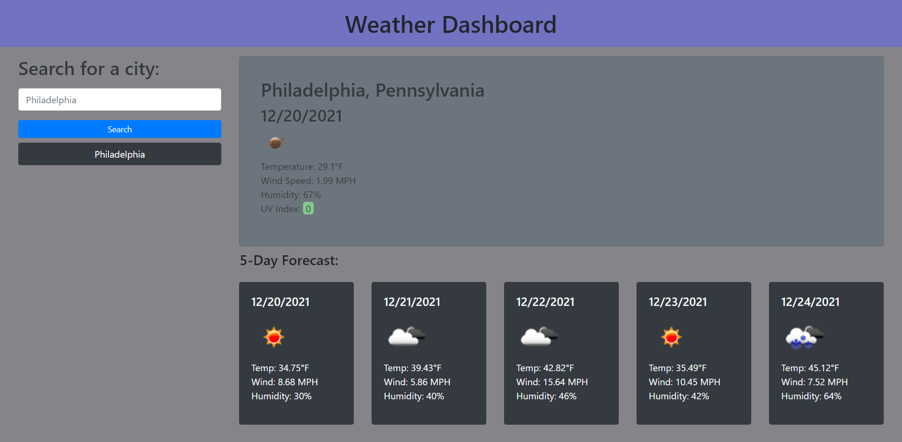

# <Weather-Dashboard>
## Description
- This project was a weather dashboard that utilizes data fetched from an API call OpenWeatherMap.
- The weather dashboard helped me to learn about fetching data from an api and then utilizing that data in my document in a dynamic way.
- It also gave me more practice with bootstrap classes and the overall structure of how I lay out my javascript functions.
## Table of Contents
- [Installation](#installation)
- [Usage](#usage)
- [Credits](#credits)
- [License](#license)
## Installation
- Not Applicable
## Usage
- Repo Link: https://github.com/jdomindev/weather-dashboard
- Deployed Link: https://jdomindev.github.io/weather-dashboard/
- Screenshot:
    
## Credits
- Thanks to my sister Maria Dominguez for guiding me through my debugging process and always being patient with me while I continue to learn to code.
- UV index color range and values taken from https://www.epa.gov/sites/default/files/documents/uviguide.pdf
## License
MIT License

Copyright (c) 2021 Jose

Permission is hereby granted, free of charge, to any person obtaining a copy
of this software and associated documentation files (the "Software"), to deal
in the Software without restriction, including without limitation the rights
to use, copy, modify, merge, publish, distribute, sublicense, and/or sell
copies of the Software, and to permit persons to whom the Software is
furnished to do so, subject to the following conditions:

The above copyright notice and this permission notice shall be included in all
copies or substantial portions of the Software.

THE SOFTWARE IS PROVIDED "AS IS", WITHOUT WARRANTY OF ANY KIND, EXPRESS OR
IMPLIED, INCLUDING BUT NOT LIMITED TO THE WARRANTIES OF MERCHANTABILITY,
FITNESS FOR A PARTICULAR PURPOSE AND NONINFRINGEMENT. IN NO EVENT SHALL THE
AUTHORS OR COPYRIGHT HOLDERS BE LIABLE FOR ANY CLAIM, DAMAGES OR OTHER
LIABILITY, WHETHER IN AN ACTION OF CONTRACT, TORT OR OTHERWISE, ARISING FROM,
OUT OF OR IN CONNECTION WITH THE SOFTWARE OR THE USE OR OTHER DEALINGS IN THE
SOFTWARE.

